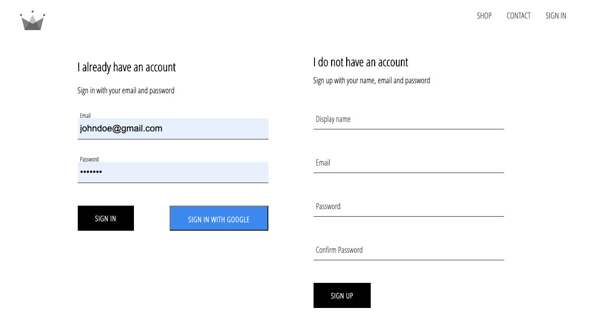
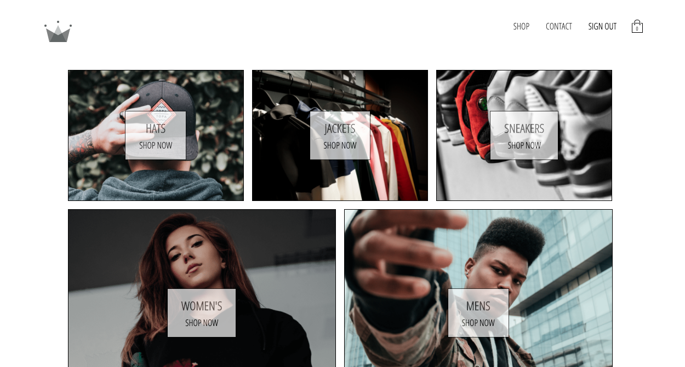
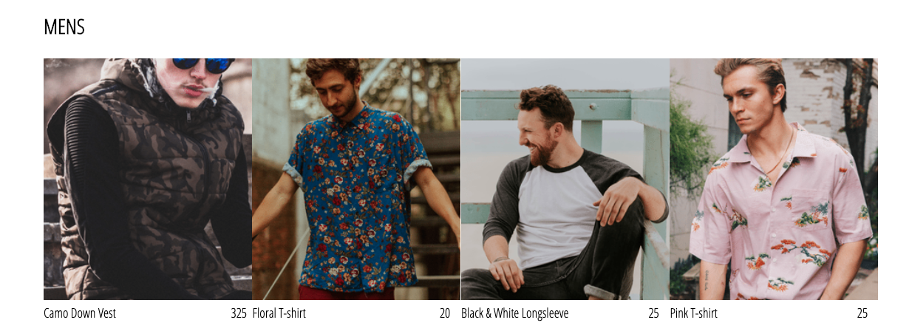
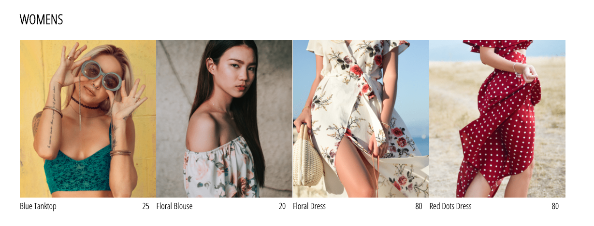
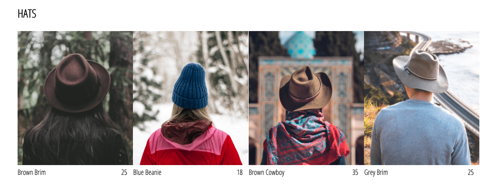
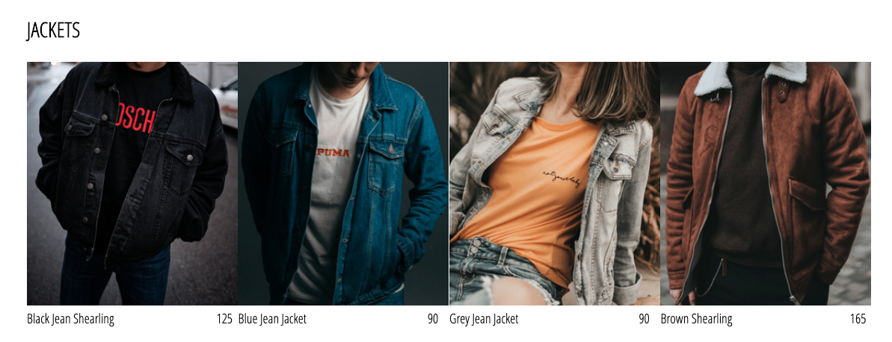
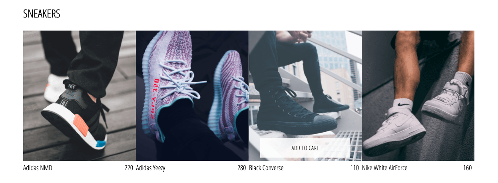
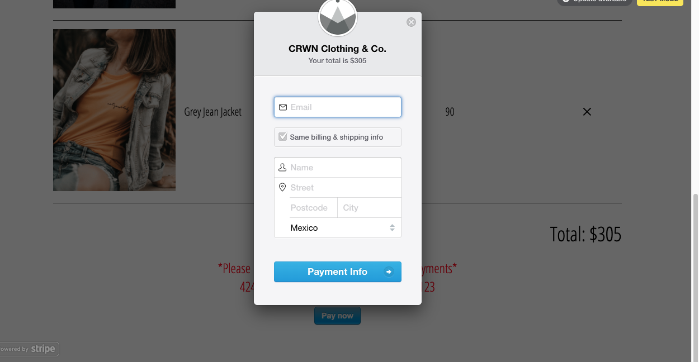

# CRWN Clothing Brand

## Crwn Clothing is a coll cut clean store design full featured with the coolest clothes!

  
### This store is a full stack website set up with the following libraries:

- [React JS](https://reactjs.org/)
- [Redux JS](https://redux.js.org/)
- [React Router](https://www.npmjs.com/package/react-router-dom)
- [Stripe](https://stripe.com/docs)
- [Redux Logger](https://github.com/LogRocket/redux-logger)
- [Redux Persist](https://github.com/rt2zz/redux-persist)
- [Styled Components](https://styled-components.com/)
- [Reselect for Redux](https://github.com/reduxjs/reselect)
- [Firebase](https://firebase.google.com/)
- [SASS](https://sass-lang.com/)
---
 
 
 
 
 
 

### Some of the things I worked on / learned on this project:

- Implementation of a register / login / google authentication with Firebase
- State managment with React JS and Redux JS
- The use of Redux persist to manage state in local storage so when reload page, the site maintains its state
- Creation of a database in Firebase in order to store:
  - Users and their purchases history
  - Clothes catalog in order by categories
- Implementation of Styled Components Library in order to keep components' styles independent and more flexible
- Implemented SASS library to manage styles (Deleted when implemented Styled Components)

### To access this repository:

- Fork this repo to your account
- Clone it to your local machine
- Run `yarn` or `npm i` to install packages
- Open your browser in `http:localhost:3000`
